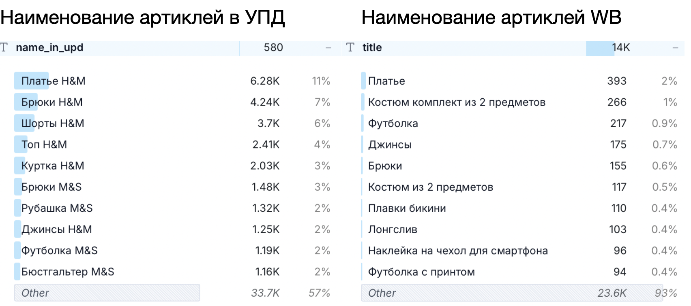
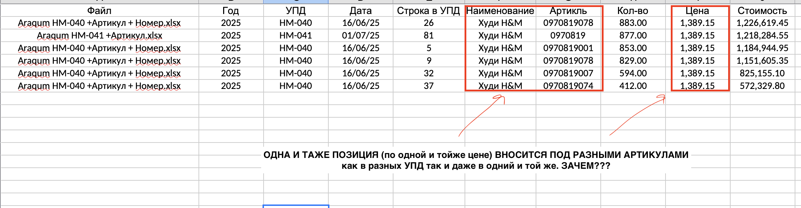
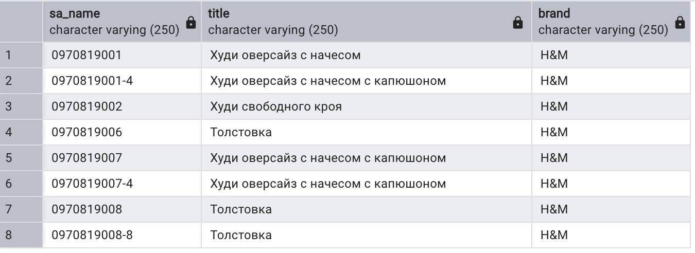
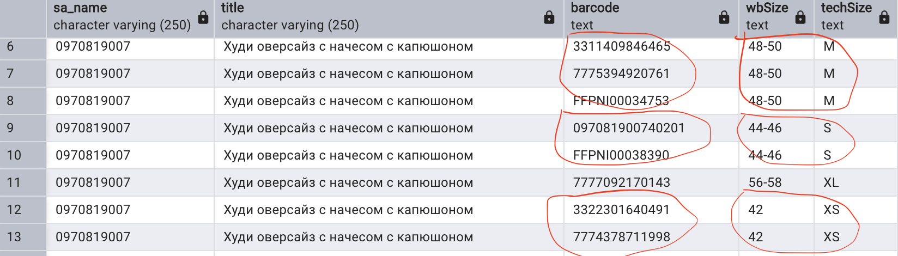
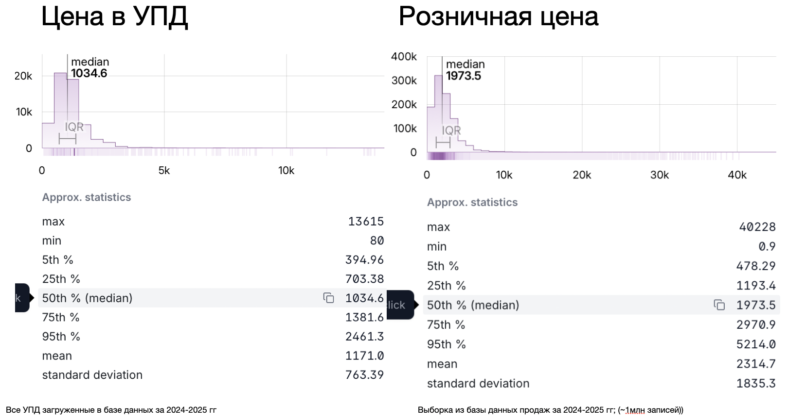
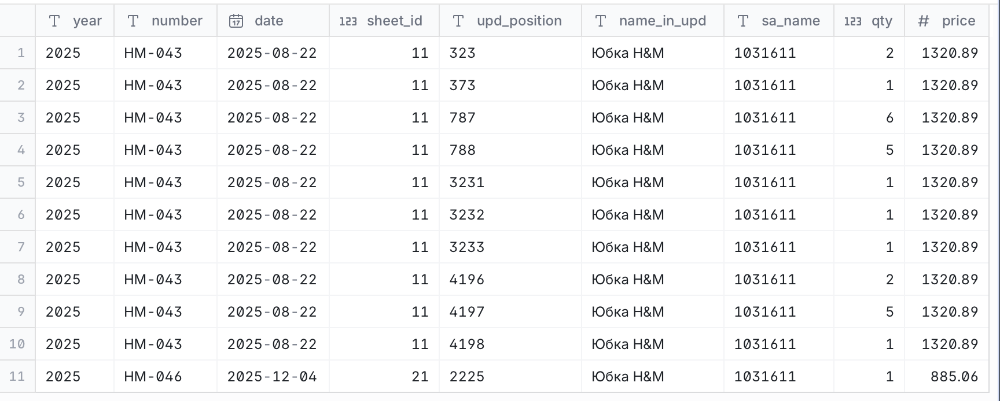
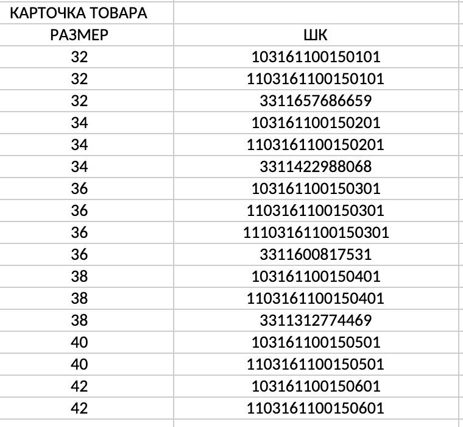
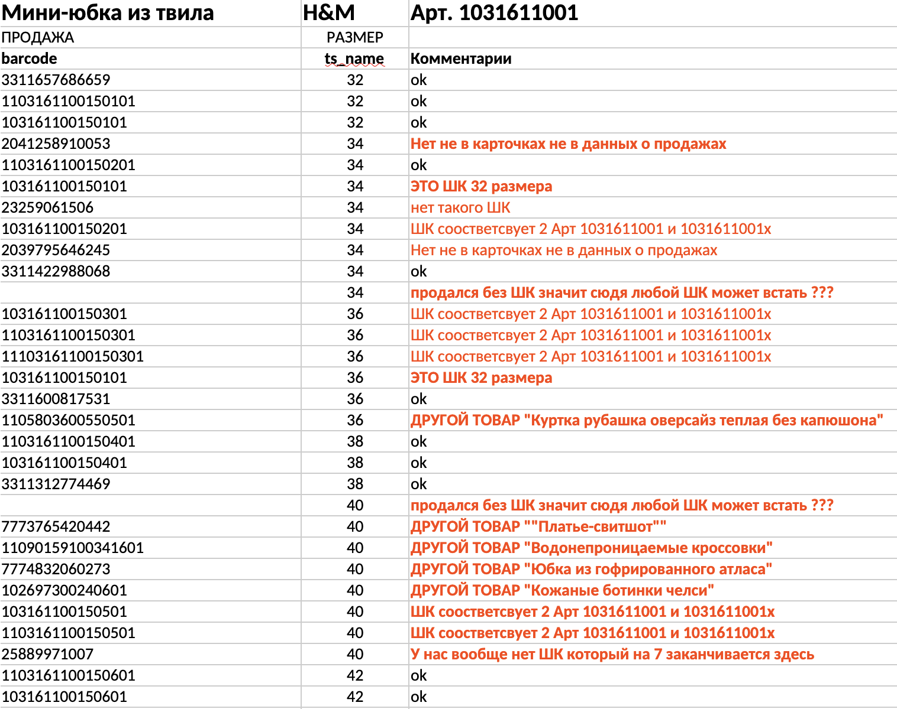

# Executive Summary

В рамках анализа данных УПД, продаж и бухгалтерского учета выявлены системные расхождения, которые не позволяют достоверно определить себестоимость, остатки и финансовый результат.

## Ключевые выводы

1. **Отсутствует единый источник данных**

Данные формируются и обрабатываются в нескольких независимых контурах (Excel, 1С, WB), без централизованной модели и контроля целостности. Это приводит к накоплению ошибок на каждом этапе обработки.

2. **Номенклатура не нормализована**

- Один и тот же товар представлен под разными артикулами;
- Один артикул может соответствовать разным товарам;
- Наименования не стандартизированы;
- Отсутствует единый справочник номенклатуры.

Это делает невозможным корректное сопоставление данных между системами.

3. **Сопоставление по штрихкодам не работает**

- В УПД отсутствуют штрихкоды;
- В карточках товаров один товар и размер могут иметь несколько штрихкодов;
- В отчетах WB используются неконсистентные штрихкоды, включая отсутствующие и относящиеся к другим товарам.

В результате учет по штрихкодам является недетерминированным и приводит к системным ошибкам.

4. **Excel используется как основной инструмент обработки**

Задача сопоставления данных является задачей реляционной алгебры, а не табличного редактирования. Использование Excel для таких операций приводит к неконтролируемым ошибкам и невоспроизводимым результатам.

5. **Фактические данные не согласуются с бухгалтерским учетом**

- Расчетная маржинальность продаж составляет 2–4%;
- При этом в бухгалтерском учете отражается прибыль и существенно заниженные списания себестоимости;
- Оценочно, за 2025 год не списано до 50% расходов.

Это указывает на недостоверность учета себестоимости.

6. **Текущий процесс является трудоемким и неустойчивым**

- Значительная часть операций выполняется вручную;
- Используются промежуточные файлы и ручные сопоставления;
- Процесс зависит от человеческого фактора и не масштабируется.

## Вывод

Текущая модель учета не обеспечивает сопоставимость данных между УПД, продажами и бухгалтерским учетом.

Это делает невозможным:
- достоверное определение себестоимости;
- корректный расчет остатков;
- получение надежного финансового результата.

# Анализ себестоимости

## Методика

- Берем все приходы в xlsx-файлах
- Формируем базу данных по приходам товара
- Сопоставляем с карточками товаров и выявляем разночтения
- Обрабатываем продажи и рассчитываем себестоимость

## Исходные данные

Исходные данные представлены в 54 файлах Excel.

Для анализа были внесены следующие изменения:
- Часть данных пришла в формате `.xls`. Пересохранена в `.xlsx`.
- Ссылки на другие файлы удалены.
- Скрытые листы удалены.

__В трех файлах отсутствуют данные о назначенных артиклях продавца (`sa_name`).__ Всего на сумму 86 млн рублей и 49,7 тыс. единиц товара.

Значения в полях «сумма» и «цена» представлены числами с плавающей точкой. Недостаточно просто отформатировать их перед импортом — требуется либо округление, либо расчет в копейках. В противном случае при импорте будут накапливаться ошибки округления на больших объемах данных.

## Обработка исходных данных

Для обработки данных УПД была создана локальная база данных, в которую были загружены данные из Excel-файлов, а также нормализованные данные из WB API. В базе используются следующие таблицы:

- sheets — перечень файлов и их атрибутов
- raw — исходный экспорт данных из Excel
- clean — обработанные данные из таблицы raw
- sales — данные о продажах с WB за период с 29.01.2024 по текущую дату
- cards — карточки товаров (включая архив), полученные через WB API в формате JSON на текущую дату
- product — рабочая таблица для обработки карточек товаров

Обработанные данные были экспортированы в Excel-файл `upds.xlsx` для формирования отчета.

Сводная информация по УПД и статистика представлены на листах `Перечень_УПД` и `UPD_stat`.

База данных приходов по УПД представлена на листе `Приходы` в отчетном файле.

## Анализ исходных данных УПД

__Всего приходы:__

- Всего записей в файлах — 58,749  
- Сумма — 1,111 млн рублей  
- Количество — 1,002,289 единиц товара  

__Статистика приходов по годам:__
 
- 2024 — 558,232 ед. на сумму 711,350,112.35 руб.  
- 2025 — 444,057 ед. на сумму 399,681,284.20 руб.  

__Уникальные поля:__

- 580 уникальных наименований vs 14 тыс. уникальных наименований в карточках товаров  
- ~19,1 тыс. уникальных артикулов vs 25,3 тыс. уникальных артикулов в карточках товаров  

При этом по данным продаж за указанный период было реализовано около 22 тыс. уникальных артикулов.

Данные свидетельствуют о существенном расхождении между УПД и карточками товаров. Дополнительно вызывает вопросы крайне низкое соотношение уникальных наименований к количеству артикулов, что указывает на отсутствие единых правил именования и классификации номенклатуры.

  
_рис. 1 Распределение наименований в УПД и карточках (очевидно, что наименования не соответствуют друг другу)_

__Проверка на пересортицу__

Для проверки корректности данных была выполнена группировка наименований номенклатуры по артикулу.

В результате:
__803 артикула имеют разные наименования.__  
Без предварительной нормализации (удаления пробелов и специальных символов) количество таких артикулов превышает 1500.

Это указывает либо на ошибки в наименованиях товаров, либо на системную пересортицу.

Примеры:

- Артикул 0976980: [Пальто H&M, Бюстгальтер H&M]  
- Артикул 0950539001: [Леггинсы/Колготки H&M, Костюм H&M]  
- Артикул 1057849: [Сандалии H&M, Свитер H&M]  
- Артикул 0941081008: [Низ купальника H&M, Плавки H&M]  

Данные позиции представлены на листе `Пересортица`.

Фактически это означает отсутствие единого справочника номенклатуры. Формирование УПД осуществляется без централизованного контроля, что приводит к накоплению ошибок при каждом новом вводе данных.

__Неоднородность артиклей__

- Одна и та же номенклатура может иметь несколько артикулов как в УПД, так и в карточках товаров. Экономический или учетный смысл такой практики отсутствует.  
- В карточках товаров одна и та же позиция дублируется под разными артикулами продавца без явных оснований.  
- В карточках товаров один и тот же размер может иметь 2 и более штрихкода.  

  
_на рисунке видно, что один и тот же товар принимается под разными артикулами, в том числе в рамках одного и того же УПД. Такая практика делает невозможным корректный учет._

  
_на рисунке видно, что один и тот же товар реализуется под разными артикулами. При этом часть артикулов отсутствует в УПД, что указывает на несогласованность учетных систем._

  
_на рисунке видно, что один и тот же товар под одним артикулом имеет несколько штрихкодов на один размер._

Если учет ведется по штрихкодам, это означает, что один и тот же товар и размер должны учитываться как разные позиции, что противоречит экономической сущности учета.

При этом WB фиксирует продажи в разрезе одного штрихкода (1 продажа = 1 штрихкод). В результате сопоставление продаж и остатков становится вероятностной задачей, а не детерминированной. Это приводит к системным искажениям себестоимости и остатков.

## Статистика по УПД и продажам

__Статистика цены (себестоимость)__

- Медианная цена в УПД — 1034.6 руб.  
- Средняя цена в УПД — 1171.0 руб.  

__Сравнение с продажами:__

- Медианная розничная цена без учета комиссии WB — 1973.5 руб.  
- Средняя розничная цена без учета комиссии WB — 2314.7 руб.  

  
_на рисунке представлено распределение закупочных цен (УПД) и цен реализации по данным продаж WB за период 2024–2025 гг._

__Расчет маржинальности продаж:__

- Медиана:  
  1973.5 − 1034.6 = 938.9 → 938.9 / 1973.5 = 47.6%  

- Среднее:  
  2314.7 − 1171.0 = 1143.7 → 1143.7 / 2314.7 = 49.4%  

__Учет комиссии WB и операционных расходов__

Комиссия WB составляет в среднем 29–33%, а с учетом логистики, хранения и прочих удержаний совокупная нагрузка может достигать 40–45%.

С учетом указанных затрат фактическая маржинальность продаж снижается до уровня порядка 2–4%.

Данный уровень маржинальности является критически низким и не позволяет покрывать постоянные издержки бизнеса даже при значительных объемах продаж.

__Сопоставление с данными бухгалтерского учета__

Результаты анализа маржинальности противоречат данным бухгалтерского учета.

- За 2024 год отражена прибыль и уплачен налог на прибыль в размере 26 млн рублей. При рассчитанном уровне маржинальности получение прибыли в таком объеме представляется экономически необоснованным.  

- За 2025 год реализовано 571 тыс. единиц товара при средневзвешенной цене 2202 руб.  
  При этом объем списания по данным бухгалтерского учета составил 311 млн рублей.

Такое значение списания возможно только при условии, что основная часть продаж приходилась на крайне дешевый ассортимент с существенно завышенной ценой реализации, что не подтверждается фактическими данными и не представляется реалистичным.

При использовании данных УПД расчетный объем списания должен находиться в диапазоне __610–680 млн рублей за 2025 год.__

Таким образом, наблюдается существенное расхождение между данными УПД, продажами и бухгалтерским учетом, что указывает на наличие системной ошибки в учете себестоимости или некорректного отражения операций.

## Сопоставление данных УПД и данных продаж

### Сопоставление по баркоду

В бухгалтерском учете списание себестоимости производится по штрихкоду. При этом провести корректное сопоставление по штрихкодам не представляется возможным, поскольку в данных УПД штрихкоды отсутствуют.

Данный подход вызывает обоснованные сомнения по следующим причинам:
- WB не гарантирует уникальность штрихкодов;
- В карточках товаров один артикул и один размер часто имеют более двух штрихкодов.

Проверка корректности списаний была выполнена на данных продаж. В качестве примера был выбран один из 10 наиболее продаваемых товаров:

- Мини-юбка из твила H&M, арт. 1031611001 (продано за 2024–2025 гг.: 724 шт. на сумму 420 тыс. руб.)

Проверка УПД показала, что данный артикул __отсутствует__ в приходах за указанный период.  
Фактически данный товар принимался под укороченным артикулом 1031611 в количестве __25 единиц__ по двум УПД в 2025 году.

  
_на рисунке видно, что арт. 1031611001 принимался по арт. 1031611_

Далее проверка карточек товара показала, что данной позиции соответствуют два артикля:
- "1031611001" — "Мини-юбка из твила"
- "1031611001x" — "Короткая юбка из твила"

Каждая карточка имеет собственные штрихкоды.  
Всего на два артикля приходится __21 штрихкод__.

Это означает, что для корректного учета по штрихкодам необходимо вести учет одной и той же товарной позиции в разрезе 21 аналитики, что не имеет практического смысла.

Анализ штрихкодов по артикулу 1031611001 показывает:
- 17 штрихкодов на 4 уникальных размера;
- выбор штрихкода WB в отчете о продажах не детерминирован.

  
_на рисунке представлены доступные штрихкоды по арт. 1031611001_

Анализ продаж данной позиции (в разрезе артикул + штрихкод) показал:

- Всего использовано __30 штрихкодов__ (при 17 доступных);
- 2 продажи отражены без штрихкода;
- Только 11 штрихкодов соответствуют карточкам товара;
- 2 штрихкода относятся к другим размерам;
- __5 штрихкодов принадлежат другим номенклатурам__ (куртка, обувь, платье и др.);
- 3 штрихкода отсутствуют в базе.

__Данный пример демонстрирует, что использование штрихкодов в качестве ключа учета себестоимости не обеспечивает корректного сопоставления данных.__

  
_на рисунке видно, что WB в отчетах использует штрихкоды неконсистентно. При этом учет по штрихкодам требует ведения множественных аналитик для одной позиции и последующего ручного сопоставления, что делает данный подход трудоемким и неэффективным._

### Сопоставление по артиклю

Сопоставление по артикулу является более устойчивым подходом, поскольку WB гарантирует уникальность своих идентификаторов (nm_id) и артикулов продавца (vendorCode / sa_name).

Однако возникает следующая проблема:
- напрямую сопоставляется менее 5% номенклатуры.

Попытка сопоставления через регулярные выражения и частичные совпадения приводит к комбинаторному росту числа возможных соответствий.

Количество потенциальных комбинаций сопоставления артикулов УПД и карточек товаров достигает порядка 10^15, что делает задачу нерешаемой без дополнительной нормализации.

Причины:
- в УПД используются как полные, так и укороченные артикулы;
- один артикул в карточках может иметь несколько вариаций;
- вариативность увеличивается нелинейно.

### Метод сопоставления

Для решения задачи был применен следующий подход:

- выделение повторяющейся части артикулов:
  - для числовых — 6 знаков;
  - для буквенно-цифровых — 8 знаков;
- укороченный артикул рассматривается как родительский идентификатор (pid);
- все связанные артикулы в УПД и продажах агрегируются по pid;
- себестоимость рассчитывается на уровне pid и списывается в продажах.

Данный подход позволяет перейти от точечного сопоставления к групповому, что существенно повышает устойчивость модели.

Результат:
- сопоставлено ~17 тыс. номенклатур из ~22 тыс. проданных;
- рассчитана себестоимость для __905 тыс. единиц__ из __1008 тыс. продаж__ (~90%).

Данный уровень сопоставления является приемлемым для статистического анализа.

## Расчет списаний и остатков

__Списания__

Списание себестоимости выполнялось по средневзвешенной стоимости на уровне групп (pid).

Ограничения:
- ~10% продаж не имеют сопоставленной себестоимости;
- метод FIFO неприменим из-за отсутствия прямого соответствия между приходами и продажами;
- отсутствует возможность однозначно определить, какие именно партии списываются со склада.

Результаты:

- За два года списано __1.002 млрд рублей__ (что соответствует ~90% объема продаж);
- За 2025 год расчетные списания составили __621 млн рублей__ без учета ~21 тыс. единиц без себестоимости;
- Данный диапазон соответствует ранее полученной оценке (610-680 млн рублей).

__Вывод:__
__По данным бухгалтерского учета не списана как минимум существенная часть расходов за 2025 год, оценочно — до 50%.__

Расчеты представлены на листах `wo` и `wo_2025`.

__Остатки__

Остатки рассчитывались на уровне групп (pid).

Основные результаты:
- отрицательные остатки — 259 тыс. единиц;
- несоответствие продажам — 103 тыс. единиц;
- совокупный отрицательный остаток и несоответсвия продажам — 362 тыс. единиц.

По данным анализа счета 45 отрицательные остатки составляют ~380 тыс. единиц товара, что подтверждает полученные результаты. Расчеты представлены на листе `inventories` в отчетом файле.

# Комментарии по учету входящего товара и себестоимости

В настоящее время процесс организован следующим образом:

1. При поступлении партии товара (импорт или закупка в РФ) сначала запрашивается связка: артикул + размер + цвет + штрихкод. Обычно это мэппинг или отгрузочный файл. В последнее время данные запрашиваются у Карины, ранее их предоставляли Седа и Богдан.

2. На основании этой связки программист формирует новый УПД из товарной накладной. Каждому товару присваивается уникальный баркод — таким образом закупленный товар приводится к формату, в котором он продается на WB. В 1С товары загружаются в виде: наименование + баркод + размер.

3. Далее выгружается вся номенклатура из 1С (частями, из-за ограничения по количеству строк), проверяется на наличие дублей, сверяется с номенклатурой в новом УПД. Новые позиции выделяются и дополнительно загружаются в 1С. Для каждой партии создается отдельная папка.

4. После обновления номенклатуры выполняется загрузка УПД. При этом ранее возникала проблема: с октября 1С перестала сопоставлять товары по баркоду, и сопоставление стало происходить по названию и размеру. В результате при загрузке часто требуется вручную выбирать нужный товар по баркоду, так как совпадений по названию может быть много.

5. После оприходования товар сразу отгружается на WB.

6. Далее выполняется обработка продаж. Детализация продаж выгружается из личного кабинета в Excel. Файл приводится к унифицированному виду: наименование, размер и баркод выносятся в отдельные столбцы, также к наименованию подтягиваются размер и баркод для корректного сопоставления проданных товаров с закупленными.

7. После этого файл загружается в 1С. Ранее процесс был во многом автоматизирован за счет сопоставления по баркоду, однако после изменения алгоритма 1С сопоставление стало происходить по названию, что привело к необходимости ручной обработки.

8. В настоящий момент сопоставление по баркоду в 1С восстановлено, в связи с чем обработка продаж должна снова выполняться в почти автоматическом режиме.

Описанный выше процесс выглядит чрезмерно трудоемким и, с высокой вероятностью, неустойчивым. Ниже приведены комментарии по каждому пункту:

1. Что представляет собой мэппинг или отгрузочный файл? Данные хранятся в разных Excel-файлах? Как именно формируется связка артикул + размер + цвет + штрихкод?

    Если речь идет о файлах, которые присылала Карина, то комментарии по вопросу уникальности артикулов уже давались ранее. Фактически используется усечение части артикула с добавлением константы в конец. Это приводит к появлению неуникальных артикулов и ошибкам уже на начальном этапе.

    Причины следующие:
    - Алгоритм мэппинга не должен строиться поверх Excel. Excel может использоваться только как источник сырых данных для импорта в базу данных, и даже для этой роли он является слабым инструментом. Для обмена данными предпочтительнее использовать текстовый CSV.
    - Должна существовать четкая структура данных для хранения входящих документов:
        - таблица артикулов с уникальными ID;
        - таблица размеров с уникальными ID;
        - таблица цветов с уникальными ID;
        - таблица связей между ними с ограничением уникальности по трем измерениям, которая и должна генерировать штрихкод по формализованному алгоритму.
    - Если требуется детерминированный штрихкод, он должен генерироваться по устойчивому правилу. Если нужен просто уникальный идентификатор, он также должен формироваться системно. Усечение артикулов и добавление констант — методологически слабое решение.
    - Если отсутствуют размер или цвет, штрихкод может быть сгенерирован технически, однако WB может интерпретировать его некорректно. При этом сама структура карточки товара не требует логики, при которой уникальность достигается ручными преобразованиями.
    - Уже на данном этапе необходим отдельный слой работы с данными, и этим слоем ни в коем случае не должен быть Excel.
    - Единственное назначение артикула и штрихкода — быть уникальными идентификаторами. Дополнительное “кодирование смысла” внутри них допустимо только при наличии строгой и документированной логики. Ручные модификации для обеспечения уникальности недопустимы.

2. Есть серьезные сомнения в том, что данный трудоемкий процесс вообще имеет смысл в существующем виде. УПД формируется через Excel, и на выходе получается противоречивый результат. В файлах присутствуют ссылки на другие файлы, вспомогательные расчеты, ошибки типов данных, скрытые листы. Возникает вопрос, зачем выполнять все это вручную и тратить значительные ресурсы, если УПД можно формировать на первом этапе из базы данных на основании уже обработанных отгрузочных файлов.

3. Неочевидно, зачем сначала выгружать всю номенклатуру из 1С, затем сверять ее с УПД и снова загружать обратно, если проблема должна решаться на шаге №1. Также не видно практического смысла в создании отдельных папок для каждой партии. Аналитику по партиям можно вести на уровне ID строки и получать разрез по каждой поставке без создания дополнительной иерархии. Любая лишняя иерархия в 1С усложняет процесс учета. С точки зрения архитектуры данных разумнее вынести аналитику по номенклатуре в отдельную нормальную базу, а в 1С хранить плоскую структуру вида GUID — номенклатура. Вопрос удобства бухгалтерии при этом вторичен по отношению к корректности модели.

4. Нельзя сопоставлять товары по наименованию или по любому другому текстовому полю, тем более в 1С, где качество аналитики уже вызывает вопросы. Для сопоставления должны использоваться устойчивые идентификаторы. Возникает прямой вопрос: почему вместе с номенклатурой не выгружается GUID? Именно на этом этапе могли возникнуть ошибки, которые делают весь последующий учет недостоверным.

5. То, что товар сразу приходуется на WB, выглядит корректным и логичным решением. Это действительно упрощает процесс и снижает количество промежуточных состояний в учете.

6. Excel и некорректно настроенная 1С являются ключевыми источниками проблем в учете. Не следует использовать выгрузки из личного кабинета WB в Excel как основу для анализа или сопоставления. WB регулярно меняет состав полей, логику расчетов и структуру отчетов. Например:
    - в 2024 году в выгрузке было 74 поля, в 2025 году — 78 полей;
    - в 2024 году для расчета нужно использовать `retail_price_with_discount`, а в 2025 году — `retail_price`;
    - в 2024 году комиссия считалась от указанного процента комиссии, а в 2025 году необходимо дополнительно учитывать эквайринг по типу 1 и корректно рассчитывать разницу между продажами и возвратами;
    - если использовать недельные данные, невозможно корректно закрыть конец месяца; если использовать дневные, необходимо дополнительно контролировать срез по часовому поясу.
    - подобных изменений и исключений множество.

    Следовательно, выгрузка из личного кабинета как основной источник для учета — это ненадежный и методологически слабый вариант.

    Если все операции по приведению данных к унифицированному виду выполняются в Excel, возникновение ошибок практически неизбежно. Задача сопоставления двух массивов данных является не офисной, а математической: по сути это задача реляционной алгебры и работы с множествами.

    Excel не является подходящим инструментом для такой обработки и изначально не предназначен для надежной работы со сложными наборами данных. Он неудобен для корректного сопоставления записей, плохо подходит для воспроизводимых преобразований и не обеспечивает нормальные механизмы работы, аналогичные JOIN, проверке соответствий, контролю дубликатов и системному сравнению множеств. Пользователь Excel, как правило, действует интуитивно по принципу “похоже на правду”, пренебрегая формальной логикой обработки данных.

7. Сопоставление по штрихкодам — наиболее уязвимое место всей схемы. Оценим задачу математически:
    - Дано:
        - в среднем в неделю торгуется 1000 уникальных номенклатур;
        - каждая номенклатура имеет в среднем 3 размера и на каждый размер по два уникальных штрихкода;
        - крайне оптимистично предполагается, что в 3 случаях из 4 WB выдает правильный штрихкод в отчете (75%);
        - предполагается идеальная сходимость по штрихкодам и полное соответствие карточек товара номенклатуре 1С, что на практике отсутствует.
    - Какова вероятность ошибки:

    - Ожидаемое количество ошибок:
        $3000 \times \frac{1}{4} = 750$

    - Вероятность идеального результата (без ошибок) — __практически ноль__:

        $\log_{10} \approx 3000 \cdot \log_{10}(0.75) \approx -374$

    - Вероятность хотя бы одной ошибки — __практически 100%__:
        $1 - \left(\frac{3}{4}\right)^{3000} \approx 1$

    - В сухом остатке можно сделать вывод, что с вероятностью, практически равной 100%, в недельной выгрузке будет хотя бы одна ошибка — и это при допущении, что карточки товара и номенклатура 1С идеально соответствуют друг другу. Чтобы такую ошибку выявить и исправить среди более чем 200 тыс. строк выгрузки Excel, необходим отдельный алгоритм на внешнем движке. Excel эту задачу надежно решить не способен.

8. Даже после восстановления сопоставления по штрихкоду в 1С фундаментальная проблема не исчезает: если исходный ключ сопоставления сам по себе ненадежен, автоматизация лишь ускоряет воспроизводство ошибок, но не устраняет их.

# Предложения по учету входящего товара и себестоимости

1. Необходимо определить единый источник данных (source of truth):

    - Создать централизованную базу данных (SQLite / PostgreSQL).
    - Организовать загрузку сырых отгрузочных файлов за весь период — фактический слой данных. Загружаются исключительно исходные данные без изменений.
    - Провести анализ фактического слоя: выявить закономерности, определить структуру данных.
    - Выполнить нормализацию данных до 3-й нормальной формы (справочники и связи), задать ограничения, первичные и внешние ключи.
    - Разработать процедуры ETL для трансформации данных. Протестировать различные гипотезы сопоставления и очистки данных.
    - Итоговая база данных становится единым источником данных для карточек товаров и системы учета (1С).

2. Приведение справочников к единой модели данных:

    - Выполнить ревизию существующих справочников и привести их в соответствие с базой данных.
    - На переходном этапе использовать промежуточный слой сопоставления (mapping table), через который будет строиться учет.
    - Объединить дублирующиеся карточки товаров под единым артикулом и идентификатором.
    - Синхронизировать номенклатуру 1С с карточками товаров и фактическими данными.
    - Учитывая, что данные продаж надежно сопоставляются по артикулу (а не по штрихкоду), рассмотреть упрощение модели:
        - использовать артикул как основной ключ учета;
        - отказаться от учета на уровне “артикул — штрихкод”;
        - перейти к модели: 1 SKU = 1 комбинация (артикул + размер + цвет).
    - Это позволяет перейти к однозначной модели: 1 продажа = 1 списание.
    - Данная гипотеза требует проверки, так как потребует изменения структуры карточек товаров.

3. Автоматизация процессов:

    - При наличии единого источника данных и нормализованной модели автоматизация становится прямым следствием архитектуры.
    - Загрузка новых карточек товаров через WB API может выполняться автоматически без ручной проверки на дубли (ограничения базы данных исключают их создание).
    - Формирование первичных документов (счет-фактура, упаковочный лист, УПД) должно выполняться автоматически на основе данных системы.
    - Отсутствует необходимость хранения данных в виде файлов и создания ручных структур (папок) в 1С.
    - Списание себестоимости может выполняться автоматически на основании ежедневных данных продаж.
    - Возможен пересчет себестоимости при изменении входных параметров без ручного вмешательства.
    - Аналитика (динамика цен, структура продаж, остатки) должна формироваться запросами к базе данных.
    - Обработка больших объемов данных (включая десятки и сотни миллионов записей) не представляет технической сложности при корректной архитектуре.

         

